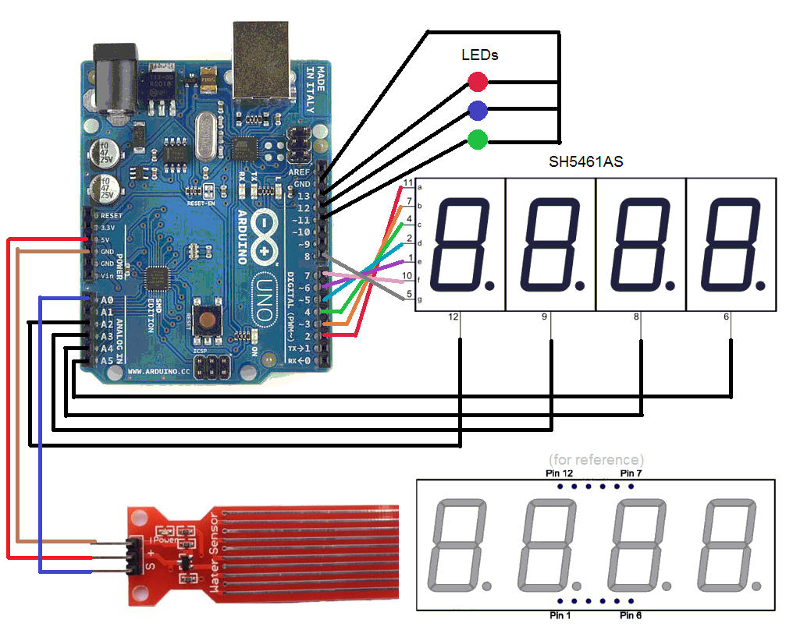

# WaterMeasure
Using Arduino with SevSeg and TimerOne Library

SevSeg  : https://github.com/DeanIsMe/SevSeg

TimerOne: https://github.com/PaulStoffregen/TimerOne

Video   : https://youtu.be/RQJTQFXbIeQ

Feature
    - Measure Water Level
    - Show Bar Graph
    - Turn on/Turn off reading via Serial by typing 0 or 1
    - Real time showing the ADC value
    - Read value to Serial every 1 sec

